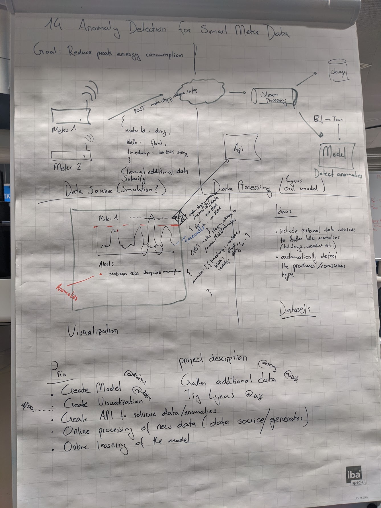

# energy-hackdays-anomaly-detection

Challenge [#14](https://hack.opendata.ch/project/579): "Anomaly Detection for Smart Meter Devices" from the open energy hackdays 2020

Energy consumption in buildings and industry is often wasted due to user behaviour, human error, and poorly performing equipment. In this context, identifying abnormal consumption power behavior can be an important part of reducing peak energy consumption and changing undesirable user behavior. With the widespread rollouts of smart meters, normal operating consumption can be learned over time and used to identify or flag abnormal consumption. Such information can help indicate to users when their equipment is not operating as normal and can help to change user behavior or to even indicate what the problem appliances may be to implement lasting changes.

This challenge is looking for data scientists to apply their skills to an anomaly detection problem using smart meter data. Ideally, such an algorithm should begin to operate after as little as 3 months and should improve over time. A platform to visualise the anomalies would also be useful. Users can select any type of machine learning algorithms that they wish to in order to detect the anomalies from the data.

###  Data

A sample including smart meter [data](https://www.kaggle.com/portiamurray/anomaly-detection-smart-meter-data-sample) can be found on kaggle. Participants are encouraged to find other smart meter data to work with in order to test their algorithms.

### Approach

- Create a basic model to detect anomalies
- Create a visualization layer to present anomalies
- Get more data of smart meters and possibly publish the datasets on opendata
- Implement a flexible architecture to allow the online processing of new data points
  - Simulate incoming data with the newly acquired datasets
  - Implement online prediction of anomalies
  - Implement online learning
  


## Development

### Frontend
To locally start the development server, first run `npm install` and afterwards `npm start`. This will start a development server which is reachable at http://localhost:4200

To build and push the docker image, run the following commands
```
npm run build-prod
docker build --no-cache -t eu.gcr.io/akenza-core-staging/meter-service-ui:v0.0.1 .  
docker push eu.gcr.io/akenza-core-staging/meter-service-ui:v0.0.1
```
